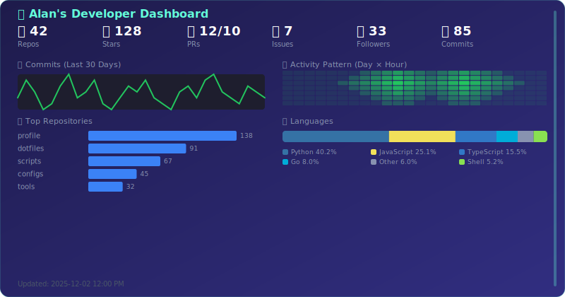
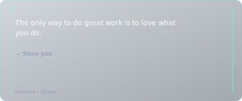
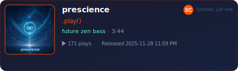
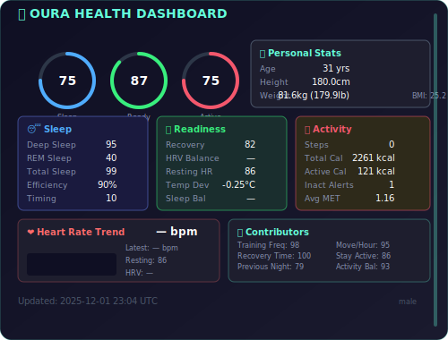
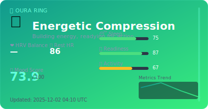
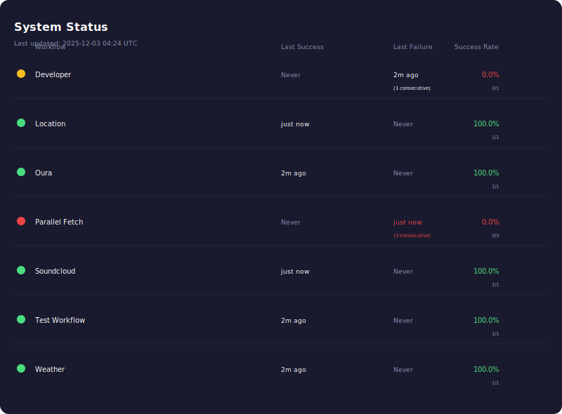

#
<!-- ═══════════════════════════════════════════════════════════════════════════ -->
<!-- 🎯 HERO SECTION                                                            -->
<!-- ═══════════════════════════════════════════════════════════════════════════ -->

<!-- markdownlint-disable MD033 -->
<div align="center">

<!-- Branded Header Banner -->


<!-- Badges Row -->
[![Version][versionBadge]][releasesUrl]
[](https://github.com/szmyty?tab=followers)

[](https://github.com/szmyty?tab=repositories)
[](https://github.com/szmyty/szmyty/actions)

<!-- ALL-CONTRIBUTORS-BADGE:START - Do not remove or modify this section -->
[](#contributors-)
<!-- ALL-CONTRIBUTORS-BADGE:END -->


</div>

<br/>

<!-- ═══════════════════════════════════════════════════════════════════════════ -->
<!-- 👤 ABOUT ME                                                                 -->
<!-- ═══════════════════════════════════════════════════════════════════════════ -->

<div align="center">

## 👤 About Me

</div>

<p align="center" width="90%">
🚀 Software engineer focusing on cloud-native systems, developer experience, creative automation, and AI-assisted tooling.  
I build high-quality, scalable platforms with strong emphasis on automation, security, and clarity.
</p>

<br/>

<!-- ═══════════════════════════════════════════════════════════════════════════ -->
<!-- 💡 DEVELOPER EXPERIENCE                                                      -->
<!-- ═══════════════════════════════════════════════════════════════════════════ -->

<div align="center">

## 💡 Developer Experience

</div>

<div align="center">

### 🎯 DX Philosophy

⚡ Automate the mundane • 🔄 Fast feedback loops  
📚 Self-documenting code • 🧩 Composable architectures

</div>

<br/>

<div align="center">

### 🏛️ Engineering Pillars

🔒 Secure by default • 📈 Scalable by design  
🧪 Test-driven quality • 🔧 Continuous improvement

</div>

<br/>

<div align="center">

### 🚀 What I Build

🛠 Developer tooling & CLIs • ☁ Cloud-native platforms  
🤖 AI-augmented workflows • 🔁 CI/CD & automation systems

</div>

<br/>

---

<br/>

<!-- ═══════════════════════════════════════════════════════════════════════════ -->
<!-- 📊 DYNAMIC DASHBOARD CARDS                                                 -->
<!-- ═══════════════════════════════════════════════════════════════════════════ -->

<div align="center">

[](https://github.com/szmyty/profile/actions/workflows/build-profile.yml)


## 📊 Workflow Performance Dashboard


<!-- ═══════════════════════════════════════════════════════════════════════════ -->
<!-- 🌐 LIVE DASHBOARD                                                          -->
<!-- ═══════════════════════════════════════════════════════════════════════════ -->

<div align="center">

## 🌐 Live Dashboard

</div>

<p align="center">
View the full interactive dashboard at:  
<br/>
<a href="https://szmyty.github.io/profile/" target="_blank" rel="noopener noreferrer">
  <strong>🚀 https://szmyty.github.io/profile/</strong>
</a>
</p>

<p align="center">
<em>The dashboard automatically updates daily with the latest metrics from all workflows.</em>
</p>

<br/>

---

<br/>

<div align="center">

## 💻 Developer Dashboard

</div>

<div align="center">

<!-- DEVELOPER-DASHBOARD:START -->

<!-- DEVELOPER-DASHBOARD:END -->

</div>

<br/>

<div align="center">

## ✨ Quote of the Day

</div>

<div align="center">

<!-- QUOTE-CARD:START -->

<!-- QUOTE-CARD:END -->

</div>

<br/>

<div align="center">

## 📍 My Location

</div>

<div align="center">

<!-- LOCATION-CARD:START -->

<!-- LOCATION-CARD:END -->

</div>

<br/>

<div align="center">

## 🌦️ Today's Weather

</div>

<div align="center">

<!-- WEATHER-CARD:START -->

<!-- WEATHER-CARD:END -->

</div>

<br/>

<div align="center">

## 🎵 Latest SoundCloud Release

</div>

<div align="center">

<!-- SOUNDCLOUD-CARD:START -->
<a href="https://soundcloud.com/playfunction/starme" target="_blank" rel="noopener noreferrer"></a>
<!-- SOUNDCLOUD-CARD:END -->

</div>

<br/>

<div align="center">

## 🧬 Oura Health Dashboard

</div>

<div align="center">

<!-- OURA-HEALTH-CARD:START -->

<!-- OURA-HEALTH-CARD:END -->

</div>

<br/>

<div align="center">

## 💫 Oura Mood Dashboard

</div>

<div align="center">

<!-- OURA-MOOD-CARD:START -->

<!-- OURA-MOOD-CARD:END -->

</div>

<br/>

---

<br/>

<div align="center">

## 📊 System Status

</div>

<div align="center">

<!-- STATUS-PAGE:START -->

<!-- STATUS-PAGE:END -->

</div>

<p align="center">
<a href="docs/MONITORING.md">📖 View detailed monitoring documentation</a>
</p>

<br/>

---

<br/>

<div align="center">

## 🔄 Unified Workflow Architecture

</div>

This repository uses a **single, orchestrated workflow** (`build-profile.yml`) that consolidates all profile updates into one cohesive pipeline. This architecture provides several key benefits:

### Architecture Benefits

- **🎯 Atomic Updates** - All cards and data updated in a single commit
- **🛡️ Error Resilience** - Continues on partial failures with automatic fallbacks
- **🔧 Simplified Maintenance** - One workflow to maintain instead of 8+ separate workflows
- **📊 Better Orchestration** - Sequential phases with proper dependencies
- **🐛 Easier Debugging** - All logs consolidated in one workflow run

### Pipeline Phases

The unified workflow executes in 10 sequential phases:

1. **Setup** - Environment, dependencies, and caching
2. **Fetch All Data** - Developer stats, Weather, Location, SoundCloud, Oura health
3. **Validate Data** - JSON schema validation and sanity checks
4. **Generate SVG Cards** - All card types with fallback handling
5. **Optimize SVGs** - SVGO compression with advanced configuration
6. **Update README** - Inject all cards into appropriate sections
7. **Build Dashboard** - React dashboard compilation and deployment
8. **Lint (Report-Only)** - MegaLinter diagnostics without blocking
9. **Commit & Push** - Atomic commit of all changes with detailed message
10. **Build Summary** - Comprehensive status report of all operations

### Error Handling Strategy

The workflow never fails due to partial errors:
- Failed data fetches fall back to cached data
- Failed card generation produces fallback SVG cards
- Failed validations log warnings but continue
- Each step uses `continue-on-error: true` where appropriate

<p align="center">
📖 <a href=".github/workflows/build-profile.yml">View workflow source</a>
</p>

<br/>

---

<br/>

<div align="center">

## ⚡ Performance Optimizations

</div>

This repository implements several performance optimizations to improve speed and reduce GitHub Actions usage:

- **🔄 Parallel API Fetching** - Fetch Oura, Weather, and SoundCloud data simultaneously (3x faster)
- **📊 Incremental SVG Generation** - Skip regeneration when data hasn't changed (50-80% time savings)
- **📦 Smart Python Dependency Caching** - Multi-layer pip caching with composite actions (60-75% faster Python setup)
- **🎨 Enhanced SVG Optimization** - Advanced compression with path simplification (30-50% smaller files)
- **💾 Multi-Level Caching** - Cache API responses, client IDs, and geocoding results

**Results**: 60-75% faster workflows, 60-70% lower GitHub Actions usage

**Documentation**: See [WORKFLOW_CACHING.md](docs/WORKFLOW_CACHING.md) for caching strategy and [CACHING_BENCHMARKS.md](docs/CACHING_BENCHMARKS.md) for performance metrics.

---

<br/>

<div align="center">

## 🔍 Monitoring & Observability

</div>

This repository includes comprehensive monitoring features:

- **📈 Workflow Metrics** - Track run times, success/failure rates, and API call counts
- **🎯 Status Dashboard** - Visual display of system health and recent updates
- **🚨 Automated Alerts** - Automatic issue creation for repeated failures (3+ consecutive)
- **✅ Data Quality Checks** - Detection of missing fields, NaN values, and out-of-range metrics

<p align="center">
📖 <a href="docs/MONITORING.md">View Monitoring Guide</a>
</p>

<br/>

---

## 🔧 Troubleshooting

Encountering workflow failures? The troubleshooting guide covers common issues and solutions:

- **🚦 Rate Limiting** - GitHub API, Nominatim, and external API rate limits
- **📋 Invalid JSON** - Validation errors and malformed responses
- **🌐 API Failures** - SoundCloud, Open-Meteo, Mapbox, and Oura issues
- **🔑 Missing Keys** - Handling missing fields and data validation
- **⚡ Concurrency** - Git conflicts and workflow collision prevention
- **⏱️ Timeouts** - HTTP request and workflow timeout handling
- **✅ Schema Validation** - Setting up and troubleshooting data validation

See [TROUBLESHOOTING.md](docs/TROUBLESHOOTING.md) for detailed solutions.

---

## 📜 Logs

</div>

All workflow logs are stored in the `logs/` directory with automatic rotation to prevent excessive file growth. The unified workflow generates logs for each operation:

- **`logs/location/`** - Location data fetching and card generation
- **`logs/weather/`** - Weather data fetching and card generation
- **`logs/oura/`** - Oura health data fetching and dashboard generation
- **`logs/developer/`** - Developer statistics and dashboard generation
- **`logs/soundcloud/`** - SoundCloud data fetching and card generation
- **`logs/megalinter/`** - MegaLinter diagnostic reports and summaries
- **`logs/build-profile/`** - Unified workflow execution logs (if created)

### Log Features

- **Persistent Logging**: All logs are committed on every workflow run, even if the workflow fails
- **Automatic Rotation**: Logs automatically rotate when they exceed 5MB
- **Timestamped Entries**: Each log entry includes UTC timestamps and severity levels (INFO, WARN, ERROR)
- **Command Tracking**: All API calls, script executions, and their exit codes are logged
- **Troubleshooting**: Use logs to debug workflow failures and track historical execution

<br/>

---

<br/>

<div align="center">

## 🛠️ Development

</div>

### Quick Start

<details>
<summary><b>🚀 Using GitHub Codespaces (Recommended)</b></summary>

<br/>

1. Click "Code" → "Create codespace on main"
2. Wait for the environment to set up automatically
3. Start developing!

</details>

<details>
<summary><b>💻 Local Development</b></summary>

<br/>

```bash
# Install dependencies with Poetry (recommended)
pip install poetry
poetry install

# Or use pip with requirements.txt (alternative)
pip install -r requirements.txt
pip install -r requirements-dev.txt

# Install pre-commit hooks
poetry run pre-commit install  # if using Poetry
# or
pre-commit install              # if using pip

# Generate cards with mock data (no API keys needed)
./scripts/dev-mode.sh all
```

**🎭 Running GitHub Actions Locally**

Test workflows locally with `act` (available in devcontainer):

```bash
# List all workflows
act -l

# Run specific job
act -j test-python

# Run workflow with secrets
act -j build-profile --secret-file .secrets
```

See [Local Development Guide](docs/LOCAL_DEVELOPMENT.md) for details.

</details>

<br/>

<details>
<summary><b>📋 Code Conventions</b></summary>

<br/>

**Script Naming**: All Python scripts use dash-case naming (e.g., `generate-card.py`, `update-readme.py`).

**Script Permissions**: Python scripts that are directly executed by workflows are marked as executable. Library modules in `scripts/lib/` are not executable.

**Dependencies**: Install required Python packages with Poetry (recommended) or pip:

```bash
# Using Poetry (pinned dependencies in poetry.lock for reproducibility)
pip install poetry
poetry install

# Or using pip (alternative)
pip install -r requirements.txt        # Core dependencies
pip install -r requirements-dev.txt    # Development tools
```

All dependencies are pinned to exact versions in `pyproject.toml` and `poetry.lock` to ensure reproducible builds and prevent breakage from upstream changes.

**Theme Configuration**: All visual styling (colors, fonts, spacing, dimensions) is centralized in `config/theme.json`.

**Pre-commit Hooks**: Run `pre-commit run --all-files` before committing to validate:

- JSON schemas
- SVG formatting
- Python linting (black, flake8, isort)
- Shell script validation (shellcheck)
- File permissions

</details>

<br/>

<details>
<summary><b>🧪 Development Mode</b></summary>

<br/>

Test card generation locally without API keys using mock data:

```bash
# Generate all cards
./scripts/dev-mode.sh all

# Generate specific cards
./scripts/dev-mode.sh soundcloud
./scripts/dev-mode.sh weather
./scripts/dev-mode.sh developer
./scripts/dev-mode.sh oura
```

Output is saved to `dev-output/` directory. See [`data/mock/README.md`](data/mock/README.md) for details on mock data.

</details>

<br/>

<details>
<summary><b>📚 Documentation</b></summary>

<br/>

- **[Local Development](docs/LOCAL_DEVELOPMENT.md)**: Run GitHub Actions locally with `act` for faster iteration
- **[Monitoring Guide](docs/MONITORING.md)**: Monitoring, observability, and alerting features
- **[Optimization Guide](docs/OPTIMIZATION_GUIDE.md)**: Performance optimizations and caching strategies
- **[Workflows](docs/WORKFLOWS.md)**: Complete guide to GitHub Actions workflows and their dependencies
- **[Mock Data](data/mock/README.md)**: Information about development mode and mock data

</details>

<details>
<summary><b>🧪 Testing</b></summary>

<br/>

Run the test suite:

```bash
python -m pytest tests/ -v
```

</details>

<br/>

---

<br/>

<!-- ═══════════════════════════════════════════════════════════════════════════ -->
<!-- 📫 FOOTER - Open Source Community & Contact                               -->
<!-- ═══════════════════════════════════════════════════════════════════════════ -->

<div align="center">


<br/><br/>

## 🤝 Open Source Community

Supporting and contributing to open-source initiatives

<br/>

[](https://opencollective.com)
[](https://www.linuxfoundation.org/)
[](https://www.cncf.io/)

<br/>

[](https://www.mozilla.org/)
[](https://www.fsf.org/)
[](https://creativecommons.org/)

<br/>

[](https://www.eff.org/)
[](https://www.apache.org/)
[](https://opensource.org/)

<br/><br/>

---

<br/>

## 📬 Get In Touch

[](https://github.com/szmyty)
[](mailto:szmyty@gmail.com)
[](https://www.linkedin.com/in/szmyty)

<br/>

### *Built with ❤️ and open-source tools*

<br/>

[![Powered by GitHub Actions][githubActionsBadge]][githubActionsUrl]

[![Automated with Poetry][poetryBadge]][poetryUrl]


</div>

## Contributors ✨

Thanks goes to these wonderful people ([emoji key](https://allcontributors.org/docs/en/emoji-key)):

<!-- ALL-CONTRIBUTORS-LIST:START - Do not remove or modify this section -->
<!-- prettier-ignore-start -->
<!-- markdownlint-disable -->
<table>
  <tbody>
    <tr>
      <td align="center" valign="top" width="14.28%"><a href="https://github.com/szmyty"><br /><sub><b>Alan Szmyt</b></sub></a><br /><a href="#code-szmyty" title="Code">💻</a> <a href="#design-szmyty" title="Design">🎨</a> <a href="#ideas-szmyty" title="Ideas & Planning">🤔</a> <a href="#maintenance-szmyty" title="Maintenance">🚧</a> <a href="#infra-szmyty" title="Infrastructure">🚇</a> <a href="#doc-szmyty" title="Documentation">📖</a></td>
      <td align="center" valign="top" width="14.28%"><a href="https://github.com/apps/github-copilot"><br /><sub><b>GitHub Copilot</b></sub></a><br /><a href="#code-github-copilot[bot]" title="Code">💻</a> <a href="#ideas-github-copilot[bot]" title="Ideas & Planning">🤔</a> <a href="#tool-github-copilot[bot]" title="Tools">🔧</a> <a href="#automation-github-copilot[bot]" title="Automation">🤖</a></td>
    </tr>
  </tbody>
  <tfoot>
    <tr>
      <td align="center" size="13px" colspan="7">
        
          <a href="https://all-contributors.js.org/docs/en/bot/usage">Add your contributions</a>
        </img>
      </td>
    </tr>
  </tfoot>
</table>

<!-- markdownlint-restore -->
<!-- prettier-ignore-end -->

<!-- ALL-CONTRIBUTORS-LIST:END -->

This project follows the [all-contributors](https://github.com/all-contributors/all-contributors) specification. Contributions of any kind welcome!

[versionBadge]: https://img.shields.io/github/v/tag/szmyty/profile?style=for-the-badge&logo=semver&logoColor=white&labelColor=1a1a2e&color=4a4e69&label=version "Version"
[releasesUrl]: https://github.com/szmyty/profile/releases
[poetryBadge]: https://img.shields.io/badge/Automated%20with-Poetry-60A5FA?style=flat-square&logo=poetry&logoColor=white
[poetryUrl]: https://python-poetry.org/
[githubActionsBadge]: https://img.shields.io/badge/Powered%20by-GitHub%20Actions-2088FF?style=flat-square&logo=github-actions&logoColor=white
[githubActionsUrl]: https://github.com/features/actions
