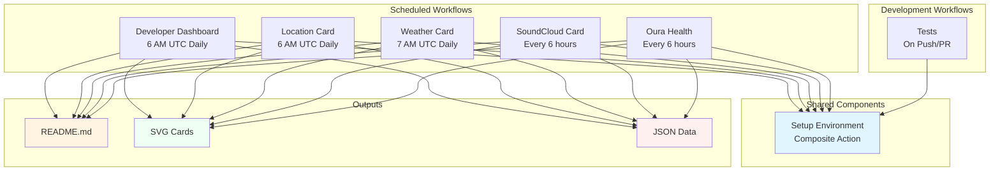

# GitHub Actions Workflows

This document provides a visual overview of the GitHub Actions workflows in this repository and how they interact.

## Workflow Diagram



## Workflow Details

### 1. Developer Dashboard (`developer.yml`)
**Schedule**: Daily at 6 AM UTC  
**Trigger**: Manual, Push to main (specific paths)

**Purpose**: Fetches GitHub statistics and generates a developer activity dashboard.

**Steps**:
1. Setup environment (composite action)
2. Fetch developer statistics from GitHub API
3. Generate developer dashboard SVG
4. Optimize SVG with SVGO
5. Update README with dashboard
6. Commit and push changes

**Outputs**:
- `developer/stats.json`
- `developer/developer_dashboard.svg`

---

### 2. Location Card (`location-card.yml`)
**Schedule**: Daily at 6 AM UTC  
**Trigger**: Manual, Push to main (specific paths)

**Purpose**: Creates a location card with a map based on GitHub profile location.

**Steps**:
1. Setup environment (composite action)
2. Get GitHub profile location
3. Fetch coordinates from Nominatim
4. Fetch location data and static map
5. Generate location SVG card
6. Optimize SVG with SVGO
7. Update README with card
8. Commit and push changes

**Outputs**:
- `location/location.json`
- `location/location-map.png`
- `location/location-card.svg`

---

### 3. Weather Card (`weather.yml`)
**Schedule**: Daily at 7 AM UTC  
**Trigger**: Manual, Push to main (specific paths)

**Purpose**: Generates a weather forecast card for the user's location.

**Steps**:
1. Setup environment (composite action)
2. Get GitHub profile location
3. Fetch coordinates from Nominatim
4. Fetch weather data from Open-Meteo API
5. Generate weather SVG card
6. Optimize SVG with SVGO
7. Update README with card
8. Commit and push changes

**Outputs**:
- `weather/weather.json`
- `weather/weather-today.svg`

---

### 4. SoundCloud Card (`soundcloud-card.yml`)
**Schedule**: Every 6 hours  
**Trigger**: Manual, Push to main (specific paths)

**Purpose**: Displays the latest SoundCloud track from a specified user.

**Steps**:
1. Setup environment (composite action)
2. Fetch SoundCloud data
3. Generate SVG card with artwork
4. Optimize SVG with SVGO
5. Update README with card
6. Commit and push changes

**Outputs**:
- `assets/metadata.json`
- `assets/soundcloud-artwork.jpg`
- `assets/soundcloud-card.svg`

---

### 5. Oura Health Dashboard (`oura.yml`)
**Schedule**: Every 6 hours  
**Trigger**: Manual, Push to main (specific paths)

**Purpose**: Generates health and mood dashboards from Oura Ring data.

**Steps**:
1. Setup environment (composite action)
2. Fetch Oura metrics
3. Generate unified health snapshot
4. Generate holistic health dashboard SVG
5. Compute mood state
6. Generate mood dashboard SVG card
7. Optimize SVGs with SVGO
8. Update README with dashboard cards
9. Commit and push changes

**Outputs**:
- `oura/metrics.json`
- `oura/health_snapshot.json`
- `oura/mood.json`
- `oura/health_dashboard.svg`
- `oura/mood_dashboard.svg`

---

### 6. Tests (`tests.yml`)
**Trigger**: Push to main, Pull requests (Python files)

**Purpose**: Runs Python unit tests to validate code changes.

**Steps**:
1. Setup environment (composite action)
2. Run pytest

**Tests**:
- Card generation tests
- Utility function tests
- Fallback mechanism tests
- Time formatting tests
- Developer dashboard tests

---

## Composite Action: Setup Environment

**Location**: `.github/actions/setup-environment/action.yml`

**Purpose**: Reusable setup steps for all workflows.

**Inputs**:
- `python-version`: Python version (default: 3.11)
- `install-jq`: Install jq (default: true)
- `install-curl`: Install curl (default: true)
- `install-python-deps`: Install requirements.txt (default: true)
- `extra-apt-packages`: Additional apt packages

**Steps**:
1. Checkout repository
2. Set up Python
3. Install system dependencies (jq, curl, extras)
4. Install Python dependencies

---

## Concurrency Control

All card generation workflows use the same concurrency group:
```yaml
concurrency:
  group: profile-update
  cancel-in-progress: false
```

This ensures that workflows don't conflict when updating the repository, but they wait for each other to complete rather than cancelling.

---

## Dependencies

### System Dependencies
- `jq` - JSON processing
- `curl` - HTTP requests
- Node.js - For SVGO (SVG optimization)

### Python Dependencies
See `requirements.txt`:
- `jsonschema` - JSON validation
- `Pillow` - Image processing
- `pytest` - Testing framework

### Development Dependencies
See `requirements-dev.txt`:
- `pre-commit` - Git hooks
- `black` - Code formatting
- `isort` - Import sorting
- `flake8` - Linting
- `check-jsonschema` - Schema validation

---

## Workflow Best Practices

1. **Use the composite action** for consistent setup across workflows
2. **Validate JSON** before processing with `jq empty`
3. **Optimize SVGs** with SVGO to reduce file size
4. **Check for changes** before committing to avoid empty commits
5. **Use semantic commit messages** with emojis for clarity
6. **Handle errors gracefully** with proper exit codes

---

## Local Development

For local testing without API keys, use the development mode:

```bash
# Generate all cards with mock data
./scripts/dev-mode.sh all

# Generate specific card
./scripts/dev-mode.sh weather
```

See `data/mock/README.md` for more details on mock data.
