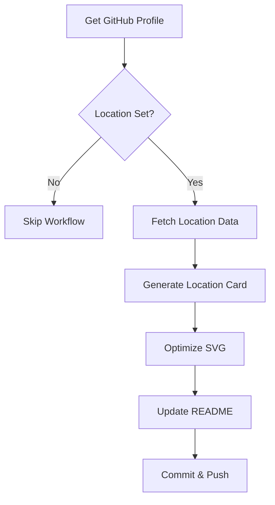
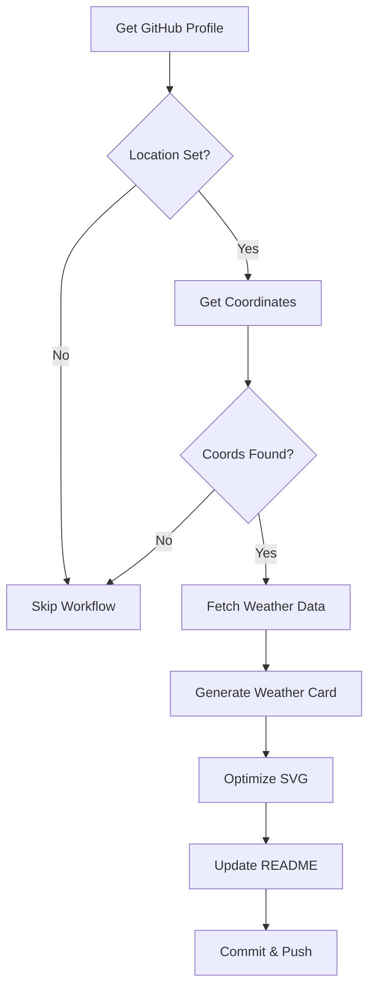
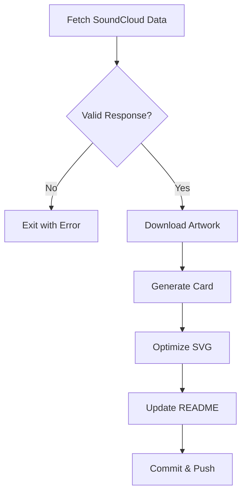
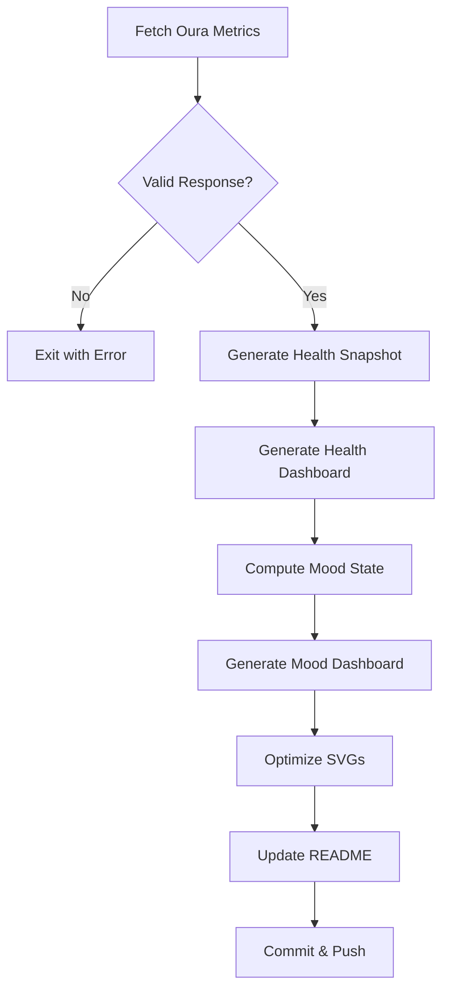

# GitHub Actions Workflows

This document describes the GitHub Actions workflows that power the profile automation system.

## Overview

The repository uses four main workflows to generate and update dashboard cards automatically. All workflows use a shared concurrency group to prevent conflicts.

## Workflow Summary

| Workflow | Schedule | Trigger Files | Output |
|----------|----------|---------------|--------|
| `location-card.yml` | Daily 6 AM UTC | `fetch-location.sh`, `generate-location-card.py` | `location/location-card.svg` |
| `weather.yml` | Daily 7 AM UTC | `fetch-weather.sh`, `generate-weather-card.py` | `weather/weather-today.svg` |
| `soundcloud-card.yml` | Every 6 hours | `fetch-soundcloud.sh`, `generate-card.py` | `assets/soundcloud-card.svg` |
| `oura.yml` | Every 6 hours | `fetch-oura.sh`, `generate-health-dashboard.py` | `oura/health_dashboard.svg`, `oura/mood_dashboard.svg` |

## Common Configuration

All workflows share these configurations:

### Triggers

```yaml
on:
  schedule:
    - cron: '...'        # Scheduled run
  workflow_dispatch:      # Manual trigger
  push:
    branches:
      - main
    paths:
      - 'scripts/...'    # Relevant scripts
      - 'config/theme.json'
      - '.github/workflows/...'
```

### Concurrency

```yaml
concurrency:
  group: profile-update
  cancel-in-progress: false
```

This ensures only one workflow runs at a time, preventing git conflicts.

### Permissions

```yaml
permissions:
  contents: write
```

Required for committing changes back to the repository.

### Artifact Management

The parallel fetch workflow uses GitHub Actions artifacts to pass data between jobs:

```yaml
retention-days: 3
```

**Retention Rationale**:
- **3-day retention** balances workflow reliability with storage efficiency
- Allows workflows to chain properly even during slow or failed runs
- Provides sufficient time for debugging issues without excessive storage costs
- Artifacts are automatically compressed and optimized (SVGs use SVGO with aggressive settings)
- JSON files are minimal (~1-5KB each)
- Total storage impact: negligible due to small file sizes and optimization

**Storage Optimization**:
- All SVG files are optimized with SVGO using multipass compression
- Floating-point precision reduced to 2 decimal places
- Unnecessary XML elements and attributes removed
- Typical SVG size reduction: 20-40%

### Common Steps

1. **Checkout**: Fetch repository with depth 1
2. **Setup Python**: Install Python 3.11
3. **Install dependencies**: `jq`, `curl`, optionally `Pillow`
4. **Fetch data**: Run shell script to get external data
5. **Generate SVG**: Run Python script to create card
6. **Optimize SVG**: Run SVGO to minimize file size
7. **Update README**: Update marker section
8. **Commit and push**: If changes detected

---

## Location Card Workflow

**File**: `.github/workflows/location-card.yml`  
**Schedule**: Daily at 6 AM UTC  
**Cron**: `0 6 * * *`

### Purpose
Generates a location card with an embedded static map from the user's GitHub profile location.

### Flow



### Environment Variables
- `GITHUB_OWNER`: Repository owner (from `github.repository_owner`)
- `GITHUB_TOKEN`: Authentication token
- `OUTPUT_DIR`: Output directory (`location`)

### Output Files
- `location/location.json`: Location metadata
- `location/location-map.png`: Static map image
- `location/location-card.svg`: Final SVG card

### Key Steps

```yaml
- name: Get GitHub profile location
  # Fetches user location from GitHub API
  # Sets skip=true if no location found

- name: Fetch location data and static map
  # Runs fetch-location.sh
  # Produces location.json and location-map.png

- name: Generate location SVG card
  # Runs generate-location-card.py
  # Embeds map image into SVG
```

---

## Weather Card Workflow

**File**: `.github/workflows/weather.yml`  
**Schedule**: Daily at 7 AM UTC  
**Cron**: `0 7 * * *`

### Purpose
Generates a weather card showing current conditions and forecast for the user's location.

### Flow



### Environment Variables
- `GITHUB_OWNER`: Repository owner
- `GITHUB_TOKEN`: Authentication token
- `OUTPUT_DIR`: Output directory (`weather`)

### Output Files
- `weather/weather.json`: Weather data
- `weather/weather-today.svg`: Final SVG card

### Key Steps

```yaml
- name: Get coordinates from location
  # Uses Nominatim geocoding API
  # Respects rate limits with 1s delay

- name: Fetch weather data
  # Runs fetch-weather.sh
  # Uses Open-Meteo API (no key required)

- name: Generate weather SVG card
  # Runs generate-weather-card.py
  # Applies weather-specific gradients
```

---

## SoundCloud Card Workflow

**File**: `.github/workflows/soundcloud-card.yml`  
**Schedule**: Every 6 hours  
**Cron**: `0 */6 * * *`

### Purpose
Generates a card displaying the latest track from a SoundCloud profile.

### Flow



### Environment Variables
- `SOUNDCLOUD_USER`: SoundCloud username (`playfunction`)
- `OUTPUT_DIR`: Output directory (`assets`)

### Output Files
- `assets/metadata.json`: Track metadata
- `assets/soundcloud-artwork.jpg`: Track artwork
- `assets/soundcloud-card.svg`: Final SVG card

### Key Steps

```yaml
- name: Fetch SoundCloud data
  # Runs fetch-soundcloud.sh
  # Extracts client_id from SoundCloud JS

- name: Generate SVG card
  # Runs generate-card.py
  # Embeds artwork as base64

- name: Update README with card
  # Creates clickable link to track
  # Uses permalink_url from metadata
```

### Notes

The SoundCloud client ID extraction uses web scraping patterns to extract the API client ID from SoundCloud's JavaScript assets. The fragile patterns are located in `scripts/fetch-soundcloud.sh`:

- **Pattern matching**: The script searches for `client_id` or `clientId` patterns in JavaScript files using regex like `'client_id[=:]["'"'"'][a-zA-Z0-9]{20,40}'`
- **CDN URL extraction**: Relies on parsing HTML for asset URLs matching `https://a-v2.sndcdn.com/assets/*.js`
- **Fallback mechanism**: Caches the last valid client ID for use when extraction fails

#### Potential Failure Scenarios

1. **JavaScript obfuscation changes**: If SoundCloud minifies or renames `client_id` to something else
2. **CDN URL pattern changes**: If SoundCloud changes their asset URL structure from `a-v2.sndcdn.com`
3. **API version changes**: If SoundCloud deprecates the `api-v2` endpoint
4. **Rate limiting**: If requests are blocked due to excessive access

#### Troubleshooting

1. Check if the cached client ID file exists: `assets/.cache/soundcloud_client_id.txt`
2. Manually test the validation endpoint in a browser
3. Inspect the SoundCloud page source for new JavaScript URL patterns
4. Check workflow logs for HTTP status codes from the validation step

---

## Oura Health Dashboard Workflow

**File**: `.github/workflows/oura.yml`  
**Schedule**: Every 6 hours  
**Cron**: `0 */6 * * *`

### Purpose
Generates comprehensive health dashboards from Oura Ring data, including a health metrics dashboard and a mood dashboard.

### Flow



### Environment Variables
- `OURA_PAT`: Personal Access Token (from secrets)
- `OUTPUT_DIR`: Output directory (`oura`)

### Output Files
- `oura/metrics.json`: Raw Oura API data
- `oura/health_snapshot.json`: Normalized health data
- `oura/mood.json`: Computed mood state
- `oura/health_dashboard.svg`: Health metrics card
- `oura/mood_dashboard.svg`: Mood state card

### Key Steps

```yaml
- name: Fetch Oura metrics
  # Runs fetch-oura.sh
  # Includes retry logic (3 attempts, 5s delay)

- name: Generate unified health snapshot
  # Runs generate-health-snapshot.py
  # Normalizes API data, computes derived values

- name: Compute mood state
  # Runs oura_mood_engine.py
  # Weighted average of health metrics

- name: Generate mood dashboard SVG card
  # Runs generate-oura-mood-card.py
  # Dynamic gradient based on mood category
```

### Retry Logic

The fetch script includes robust retry handling:
```bash
MAX_RETRIES=3
RETRY_DELAY=5

for i in $(seq 1 $MAX_RETRIES); do
    if fetch_data; then
        break
    fi
    sleep $RETRY_DELAY
done
```

---

## Manual Trigger

All workflows support manual triggering via `workflow_dispatch`:

1. Go to **Actions** tab in GitHub
2. Select the workflow
3. Click **Run workflow**
4. Choose branch and click **Run workflow**

This is useful for:
- Testing workflow changes
- Forcing an update outside the schedule
- Debugging issues

---

## Error Handling

### Common Failure Points

1. **Missing GitHub location**: Workflows skip gracefully
2. **API rate limits**: Nominatim has strict limits (1 req/sec)
3. **Invalid JSON**: Validated with `jq empty` before processing
4. **Missing secrets**: OURA_PAT must be configured

### Skip Conditions

Workflows use output flags to skip subsequent steps:
```yaml
- name: Check condition
  id: check
  run: |
    echo "skip=true" >> $GITHUB_OUTPUT

- name: Only if not skipped
  if: steps.check.outputs.skip != 'true'
  run: ...
```

---

## Maintenance

### Monitoring

- Check **Actions** tab for workflow run history
- Review commit messages for update patterns
- Monitor for consistent failures

### Common Fixes

1. **Rate limiting**: Add delays between API calls
2. **Breaking changes**: Update scraping patterns
3. **Secret expiration**: Regenerate OURA_PAT token

### Testing Changes

1. Make changes on a branch
2. Use manual trigger to test
3. Review generated artifacts
4. Merge to main when satisfied

---

## Troubleshooting

For comprehensive troubleshooting guidance including rate limiting, JSON validation, API failures, timeout handling, and more, see the [Troubleshooting Guide](TROUBLESHOOTING.md).
